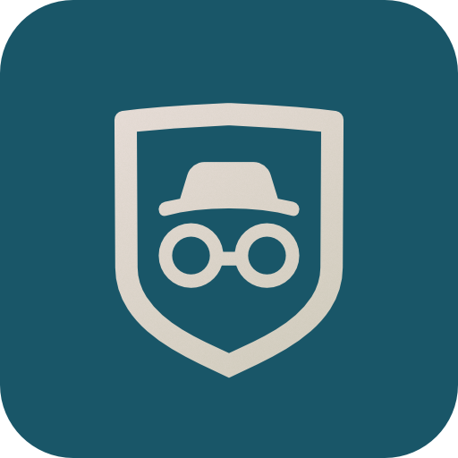

# Privacy Guardian: Your Android Microphone Shield

  
  <h1 style="margin:0px;">Privacy Guardian</h1>
  
An innovative Android application designed to give you unprecedented control and transparency over your device's microphone usage.

## Features

* **Real-time Monitoring**: Get instant notifications whenever an application accesses your device's microphone.
* **Intelligent Anomaly Detection**: Privacy Guardian identifies unusual behaviors, such as microphone access by background apps, apps without necessary permissions, or when the screen is off.
* **Advanced Audio Classification**: Integrating a **TensorFlow Lite (TFLite)** model, the app classifies the type of audio being recorded (e.g., voice, music, ambient noise), adding valuable context to each access event.
* **Detailed Logs**: All microphone accesses are logged with date, time, the involved application, and, if available, the classified audio type.
* **Customizable Notifications**: Notifications are differentiated for normal accesses and anomalies, with varying priorities to ensure critical alerts don't go unnoticed.
* **Foreground Service**: The application runs as a foreground service, ensuring continuous and reliable monitoring, even when the app is not in active use.

## Why Choose Privacy Guardian?

In today's digital age, protecting your privacy is more crucial than ever. Privacy Guardian puts you back in control, allowing you to know exactly when and how your apps are using your microphone. Whether it's a legitimate app recording a voice message or potential spyware, you'll always be informed and protected.

## App Preview

Take a look at Privacy Guardian in action!

### Screenshots

  
  
  
  
  
  
  
  

### Video Overview

<video style="margin:0 auto; width:30%" src="preview/Privacy Guardian - Overview.mp4"></video>

## Contribute

Privacy Guardian is an **open-source** project, and we welcome contributions from the community. If you're interested in improving the application, reporting bugs, or suggesting new features, feel free to open an **issue** or a **pull request** on our GitHub repository.

## Requirements

* Android 10 (API 29) or higher for full support of audio recording configuration monitoring.
* **Accessibility Service** and **Usage Stats** permissions must be manually enabled by the user for proper functionality.

## License

This project is released under the MIT License. See the [LICENSE](LICENSE) file for more details.

## Contact

For questions or suggestions, you can open an issue in the repository.